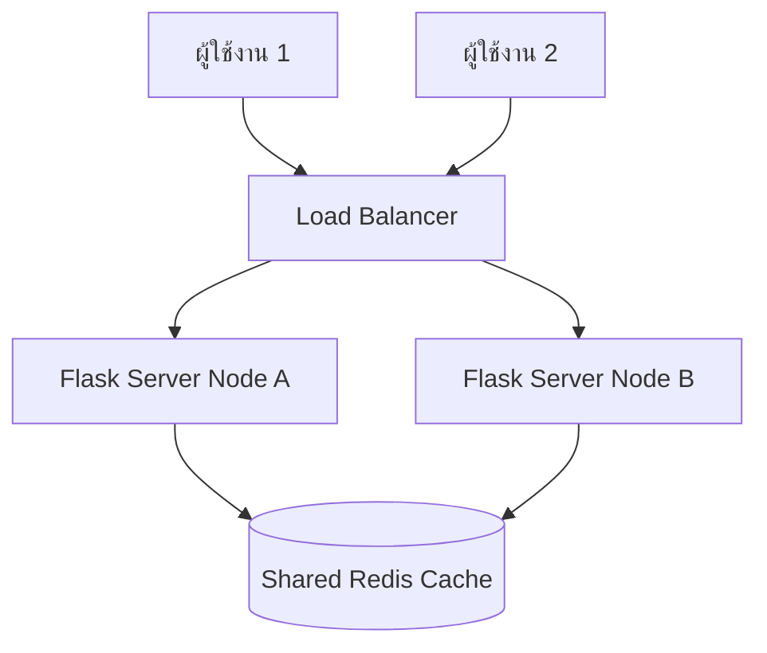

# คู่มือการขยายขีดความสามารถของระบบและเซสชัน (System & Session Scaling Manual)

เอกสารนี้ระบุแนวทางและวิธีการปรับปรุงโครงสร้างพื้นฐานเมื่อระบบมีผู้ใช้งานเพิ่มขึ้นอย่างมหาศาล หรือต้องการทำ **High Availability (HA)** โดยการติดตั้งเซิร์ฟเวอร์แบบโหลดบาลานซ์ (Load Balancers) ร่วมกับเซิร์ฟเวอร์หลังบ้านหลายเครื่อง (Multi-worker Web Servers / Gunicorn)

---

## 1. ปัญหาของเซสชันแบบดั้งเดิม (The Session Problem)

ปัจจุบันระบบของเราเก็บข้อมูลเซสชันความปลอดภัยไว้บนคุกกี้ที่เข้ารหัสในฝั่งเบราว์เซอร์ ซึ่งเก็บสถานะการเข้าสู่ระบบไว้ที่เซิร์ฟเวอร์เดี่ยว (Single Server Node):
*   **หากมีเว็บเซิร์ฟเวอร์หลังบ้านเครื่องเดียว**: ทำงานได้ปกติ ปลอดภัย และไร้กังวล
*   **หากขยายเครื่องเซิร์ฟเวอร์หลังบ้านเป็น 3 เครื่อง (Node A, Node B, Node C)**: เมื่อนักสปินล็อกอินผ่านเครื่อง Node A แล้วหน้าเว็บถัดไปถูกกระจายความรับผิดชอบไปหาเครื่อง Node B ตัวเครื่อง Node B จะไม่รู้จักข้อมูลเซสชันนั้น ทำให้นักศึกษาจะถูกเด้งออกจากระบบ (Session Desynchronization)

---

## 2. การแก้ไขด้วย Redis Session Store (Shared Session)

เพื่อทำให้แอปพลิเคชัน Flask ของเราเป็นแบบ **Stateless** (สามารถรันบนกี่เซิร์ฟเวอร์ก็ได้) เราต้องแยกสถานะการล็อกอิน (Session State) ไปฝากไว้ที่ฐานข้อมูลสแกนเร็วแบบ InMemory อย่าง **Redis** ร่วมกัน ดังแผนผังนี้:



---

## 3. ขั้นตอนการตั้งค่าในโค้ด (Step-by-Step Implementation)

### ขั้นตอนที่ 1: ติดตั้งไลบรารีเพิ่มเติม
ให้ติดตั้งแพ็กเกจ `redis` และ `Flask-Session` ลงในระบบ:
```bash
pip install redis flask-session
```

### ขั้นตอนที่ 2: ตั้งค่าไฟล์ `app.py`
เพิ่มการตั้งค่าเซสชันให้เรียกใช้ฐานข้อมูล Redis:
```python
import redis
from flask_session import Session

# แทรกคำสั่งการตั้งค่านี้หลังจากประกาศตัวแปร app = Flask(__name__)
app.config['SESSION_TYPE'] = 'redis'
app.config['SESSION_PERMANENT'] = False
app.config['SESSION_USE_SIGNER'] = True
app.config['SESSION_KEY_PREFIX'] = 'activity_session:'

# ระบุ URL ของเครื่องเซิร์ฟเวอร์ Redis ของคุณ
app.config['SESSION_REDIS'] = redis.from_url('redis://127.0.0.1:6379')

# เริ่มต้นระบบจัดการเซสชันส่วนกลาง
server_session = Session(app)
```

---

## 4. สรุปประโยชน์ที่จะได้รับ

1.  **ความเสถียรขั้นสูงสุด (High Availability)**: เซิร์ฟเวอร์หลังบ้านเครื่องใดเครื่องหนึ่งพังหรือหยุดให้บริการ (Shutdown) ผู้ใช้งานก็ยังสามารถคลิกทำงานต่อได้โดยไม่ต้องล็อกอินใหม่ เพราะเซสชันถูกฝากไว้ที่ Redis
2.  **ประสิทธิภาพระดับไมโครวินาที**: Redis สามารถรันคำสั่งอ่าน/เขียนระดับ 100,000 requests/sec ทำให้ไม่มีอาการหน่วงในระหว่างการตรวจสอบสิทธิ์ของผู้ใช้
3.  **ความยืดหยุ่นในการสเกล (Scalability)**: เพิ่มขนาดและจำนวนเครื่องเซิร์ฟเวอร์ Flask ได้อย่างไม่มีจำกัด (Horizontal Scaling)
